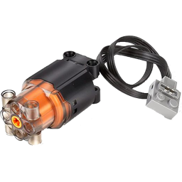

# Disclaimer

Lego's "<a href="https://www.lego.com/en-us/themes/power-functions/about">Power Functions</a>" product line was discontinued in 2018, in favor of the "<a href="https://www.lego.com/en-us/themes/powered-up/about">Powered Up</a>" line. Currently, the only ways to obtain new components from the Power Functions line are by purchasing these original Lego components on the second-hand market, or by purchasing these new components, manufactured by alternative companies such as <a href="https://mouldking.store/shop/mould-king-power-function-parts-v2-0/">Mould King</a>, <a href="https://decadastore.com/products/cada-power-pack-pro-s059-003">CaDA</a> and <a href="https://pt.aliexpress.com/w/wholesale-lego-power-function.html">Generics</a>. These can also be found on global e-commerce sites such as <a href="https://aliexpress.com">Aliexpress</a>. If you want to know what exactly Lego Power Functions is, continue reading to the next topic.

> [!NOTE]
> My project "Lego Creative Hub" has no connection or link with the company "The Lego Group" and is not endorsed by it.

# What is Lego Power Functions?

Lego Power Functions (abbreviated as PF) is a line of electronic components that are compatible and fit into Lego bricks, including Motors, Lights, IR Remote Controls, IR Receivers and different types of Battery Boxes. These components operate in the voltage range of 9v or 7.4v and are connectable to each other using cables with Brick-Shaped Connectors.

The main Power Functions components originally manufactured by Lego consist of the following:

<table>
    <tr>
        <td> Extension Cable</td>
        <td> Control Switch</td>
        <td> IR Speed R. Control</td>
        <td> IR Remote Control</td>
    </tr>
    <tr>
        <td> IR Receiver</td>
        <td> LED Lights</td>
        <td> XL Motor</td>
        <td> L Motor</td>
    </tr>
    <tr>
        <td> M Motor</td>
        <td> E Motor</td>
        <td> Servo Motor</td>
        <td> Buggy Motor</td>
    </tr>
    <tr>
        <td> Train Motor</td>
        <td> AA Battery Box</td>
        <td> AAA Battery Box</td>
        <td> Rechargeable Batt. Box</td>
    </tr>
</table>

Alternative manufacturers such as Mould King, CaDA and generics, manufacture most of the above components, and also manufacture proprietary components (all compatible with Lego components) such as the following mains:

<table>
    <tr>
        <td> L Black Burst Motor</td>
        <td> S 2x3 Motor</td>
        <td> S 2x4 Motor</td>
        <td> Smoke Sprayer</td>
    </tr>
    <tr>
        <td> Auto Smoke Sprayer</td>
        <td> Bluetooth LE Speaker</td>
        <td> Rechargeable Batt. Box</td>
        <td> Rechargeable Batt. Box</td>
    </tr>
    <tr>
        <td> BT Controller</td>
        <td> Battery & BT Receiver</td>
    </tr>
</table>

Power Functions are the successors to the "9v System", also from Lego, and were launched on the market in 2007, and discontinued by Lego in 2018, although it continues to be produced by alternative brands such as Mould King, CaDA and other generic brands.

When you combine the components from the Power Functions line, along with other Lego components, such as Beams, Bricks, Arms, Axles, Gears, Wheels, Pneumatic Cylinders, Chains, Belts, Tracks, Suspensions and many other types of components, you can bring to life many and many of your ideas involving mechatronics or even robotics. It is a great hobby and way to study these items.

The videos below gives a good example of how to create something with the Power Function line, in conjunction with other types of Lego components:

https://github.com/user-attachments/assets/63a842e1-44fb-44d3-848d-450e74e0689d

https://github.com/user-attachments/assets/56379425-7275-4fc7-9d4f-2737cf9221b9

https://github.com/user-attachments/assets/18485da4-44a5-4f7b-a229-e5b5ab259297

    <small>
        Credits for the videos above go to the <a href="https://www.youtube.com/@BrickExperimentChannel">Brick Experiment Channel</a>
    </small>

# What is Lego Creative Hub and what is the goal?

The Lego Creative Hub is a Hub project to be used in your Lego projects and constructions that use Power Functions components. A Lego Creative Hub should act as a true central component, being the brain of your construction, controlling all the Power Functions components of your construction, and still having the possibility of controlling Modules and reading Sensors created for Arduino/ESP32, this way, you can perfectly combine constructions with Power Function, while using Arduino/ESP32 Actuators and Sensors.

The goal of the Lego Creative Hub is to be a true Hub for your projects, being easy to use, programmable and providing the greatest possible convenience and creative freedom for your built gadgets. To achieve this goal, the Lego Creative Hub has the following key features:

- Has Open Source Software.
- Cheap to recreate.
- Uses Xbox or Playstation Bluetooth Controllers for Input, instead of IR Controllers like Lego.
- Can control up to 4 Power Function Motors (and other PF components except Power Function LEDs).
- Can control up to 2 Geekservo Motors.
- Can have connected, Sensors and Actuators designed for Arduino/ESP32.
- It can be programmed through an Android app.
- For better work, it has a complete Input and Output kit, including Buttons, Display, LED and Buzzer.
- Only needs to be connected to a Lego Battery Box to power itself and all the components connected to the Hub.
- Displays the remaining percentage of battery life.
- Other minor, but interesting things.

The Lego Creative Hub is divided into two parts, Hardware and Software. In the next topic you will see what to do if you want to use this project in your Power Functions builds.

# Using Lego Creative Hub in your Power Function projects

As previously stated, the Lego Creative Hub is divided into two parts, the Hardware and the Software. The Hardware is basically the mini-computer, which you will need to build your copy on. Once you have your copy built, you will need to grab the code from this repository and upload it to the mini-computer, which will then run the Software, bringing the mini-computer you built, to life, and transforming it into the Lego Creative Hub.

The entire process of how to assemble your copy of the mini-computer, prepare it, load the source code, how to use it, etc, is explained in the following topics. So if you are interested in using the Lego Creative Hub, just keep reading! :)

# Prerequisites

If you want to assemble and use Lego Creative Hub, you must have some minimum knowledge required in some areas, as listed below:

- Electronics Basics (The minimum, for example, to not create a short circuit).
- Soldering of components with Tin and similar.
- Basic of programming.
- Basics of hardware assembly (such as PCs, for example).
- At least basic knowledge about Arduino/ESP32.

If you do not have all of the above minimum requirements, then I recommend that you study up on what you do not have or ask someone who does to recreate Lego Creative Hub for you.

If you meet all of the above minimum requirements, then you are ready to proceed to create your copy of Lego Creative Hub. So just keep reading all the next topics.

# Assembling the Lego Creative Hub Mini-Computer

Before we start the assembly of the mini-computer, see all the components we will need. In everything related to electronic modules and components, you should buy EVERYTHING that is the same as the one indicated. If you can't find something that is exactly the same, buy something similar but that performs the same functions with the same capabilities or as closer as possible.

<table>
    <tr>
        <td>Photo&nbsp;&nbsp;&nbsp;&nbsp;&nbsp;&nbsp;&nbsp;&nbsp;&nbsp;</td>
        <td>Qty</td>
        <td>Component&nbsp;&nbsp;&nbsp;&nbsp;&nbsp;&nbsp;&nbsp;&nbsp;&nbsp;&nbsp;&nbsp;&nbsp;&nbsp;&nbsp;</td>
        <td>Description</td>
    </tr>
    <tr>
        <td></td>
        <td>1x</td>
        <td>42mm x 58mm Base or Case</td>
        <td>The Case or Base, aims to hold all the components of the mini-computer so that it is possible to attach the mini-computer in your Power Function construction reliably, as if it were a Lego product. If you want to choose a Case/Base of different size, feel free to do so, but try to buy Universal PCBs of the same size so that the mini-computer is more beautiful. If you want to buy the exact same photo Case, use this <a href="https://pt.aliexpress.com/item/1005007825792651.html">link</a>.</td>
    </tr>
    <tr>
        <td></td>
        <td>3x</td>
        <td>40mm x 60mm Universal PCBs</td>
        <td>Universal PCBs offer a reliable, cheap, fast, and simple way so we can hold the electronic components we will use in the mini-computer. Make sure you choose PCBs the same size as your Case or Base, chosen. If you choose PCBs sizes differently from the one recommended here, then you can distribute components differently and may require more or less PCBs. With these PCBs of this recommended size, we will make a "mini tower" with 3 floors of components, resulting in a "high" but still compact mini-computer. If you want to buy the exact same photo Universal PCBs, use this <a href="https://pt.aliexpress.com/item/1005006665029598.html">link</a>.</td>
    </tr>
</table>